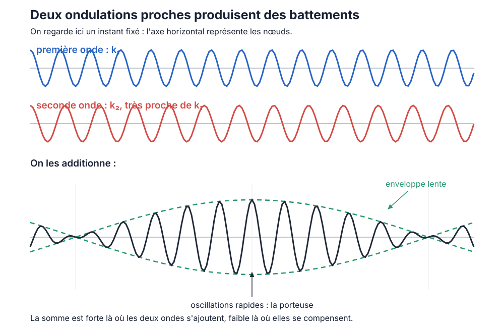

# Chapitre VI — Pourquoi les objets s'étalent-ils ?

> **Question.** Nous savons désormais fabriquer un profil mobile en combinant des formes spatialement fixes. Pourquoi certains profils voyagent-ils sans se déformer, tandis que d'autres finissent par s'étaler ?

Le chapitre V a donné le déclic : une bosse mobile n'est pas un nouveau type d'objet ajouté à la théorie. C'est une combinaison de modes propres, chacun immobile dans l'espace mais animé dans le temps. Il reste à comprendre comment cette combinaison peut conserver sa forme — ou la perdre.

## 1. L'anneau : un univers où tous les lieux se valent

Pour parler proprement de déplacement, choisissons un graphe qu'un décalage ne modifie pas : l'**anneau** à $`N`$ nœuds. Les nœuds sont numérotés $`0,1,\ldots,N-1`$, chacun est relié à ses deux voisins, et les indices sont lus modulo $`N`$.

Décaler tout le champ d'un cran,

```math
(u_0,u_1,\ldots,u_{N-1})
\longmapsto
(u_{N-1},u_0,\ldots,u_{N-2}),
```

ne change ni les voisinages ni la règle d'évolution. Il existe donc ici une notion naturelle de translation, contrairement à ce qui se passe sur un graphe quelconque.

### Une liste finie d'ondulations

Comme au chapitre V, les profils propres de l'anneau peuvent être décrits par des ondulations régulières :

```math
\varphi^{(k)}_n=\cos(kn),
\qquad
\psi^{(k)}_n=\sin(kn).
```

Le nombre placé à l'intérieur du cosinus ou du sinus s'appelle la **phase** : il indique où l'on se trouve dans le cycle de l'ondulation. Ici, la phase au nœud $`n`$ vaut $`kn`$. Le nombre $`k`$ indique donc de combien cette phase augmente lorsqu'on avance d'une arête. Pour que le dessin se referme après $`N`$ arêtes, il faut

```math
k=k_m=\frac{2\pi m}{N},
\qquad m\in\{0,1,\ldots,N-1\}.
```

Sur un anneau à douze nœuds, par exemple :

| $`m`$ | $`k=2\pi m/12`$ | Ce que fait le motif en un tour de l'anneau |
|---:|:---:|:---|
| $`0`$ | $`0`$ | il reste constant |
| $`1`$ | $`\pi/6`$ | il effectue une oscillation complète |
| $`2`$ | $`\pi/3`$ | il effectue deux oscillations complètes |
| $`6`$ | $`\pi`$ | il alterne $`+,-,+,-,\ldots`$ à chaque nœud |

Ainsi, **grand $`k`$ signifie motif spatialement serré** ; petit $`k`$, motif spatialement étalé. Il ne s'agit pas d'introduire arbitrairement toutes les valeurs réelles de $`k`$ : sur l'anneau fini, nous avons d'abord une liste finie de motifs. Les fonctions trigonométriques sont seulement une écriture commode de cette liste.

Vérifions l'action du Laplacien :

```math
\begin{aligned}
(L\varphi^{(k)})_n
&=2\cos(kn)-\cos(k(n-1))-\cos(k(n+1))\\
&=2(1-\cos k)\cos(kn).
\end{aligned}
```

Ainsi,

```math
L\varphi^{(k)}=\lambda(k)\varphi^{(k)},
\qquad
\lambda(k)=2-2\cos k=4\sin^2\!\frac{k}{2},
```

et le même calcul vaut pour $`\psi^{(k)}`$.

**Petit contrôle de comptage, facultatif en première lecture.** Les valeurs $`k`$ et $`-k`$ ne donnent pas quatre profils indépendants, car

```math
\cos(-kn)=\cos(kn),
\qquad
\sin(-kn)=-\sin(kn).
```

De plus, le sinus est nul pour $`k=0`$, ainsi que pour $`k=\pi`$ lorsque $`N`$ est pair. En choisissant une seule fois chaque profil indépendant, on retrouve bien $`N`$ modes au total.

## 2. Comment deux formes fixes produisent une onde mobile

Commençons sans formule générale. Sur l'anneau à quatre nœuds, prenons les deux profils du chapitre V :

```math
\varphi_{\cos}=(1,0,-1,0),
\qquad
\varphi_{\sin}=(0,1,0,-1).
```

Ils représentent la même ondulation, décalée d'un nœud. Pour $`c=1`$, faisons varier leurs amplitudes selon le tableau suivant :

| $`t`$ | amplitude de $`\varphi_{\cos}`$ | amplitude de $`\varphi_{\sin}`$ | somme $`u(t)`$ |
|---:|---:|---:|:---|
| $`0`$ | $`1`$ | $`0`$ | $`(1,0,-1,0)`$ |
| $`1`$ | $`0`$ | $`1`$ | $`(0,1,0,-1)`$ |
| $`2`$ | $`-1`$ | $`0`$ | $`(-1,0,1,0)`$ |
| $`3`$ | $`0`$ | $`-1`$ | $`(0,-1,0,1)`$ |
| $`4`$ | $`1`$ | $`0`$ | $`(1,0,-1,0)`$ |

À chaque ligne, le même dessin s'est déplacé d'un nœud vers la droite. Pourtant, les deux profils de départ sont fixes : seules leurs amplitudes changent. Ils se passent le relais.

Mettons maintenant des noms sur ce que montre le tableau. Ici, l'ondulation avance d'un quart de tour spatial lorsqu'on parcourt une arête : son nombre d'onde est $`k=\pi/2`$. Elle avance aussi d'un quart de cycle temporel à chaque pas : sa fréquence est $`\omega=\pi/2`$.

| Symbole | Il mesure la variation lorsque l'on avance… | Il décrit donc… |
|:---:|:---|:---|
| $`k`$ | d'une arête dans l'espace | le resserrement spatial du motif |
| $`\omega`$ | d'un pas dans le temps | la rapidité de son oscillation |

Pour un $`k`$ non exceptionnel, le cosinus et le sinus ont la même valeur propre. Leurs amplitudes temporelles obéissent donc à la même récurrence. Le tableau précédent se résume par

```math
u_n(t)=\cos(\omega t)\cos(kn)+\sin(\omega t)\sin(kn).
```

La formule d'addition donne

```math
u_n(t)=\cos(kn-\omega t).
```

Le dessin n'est plus seulement animé sur place : sa phase $`kn-\omega t`$ se décale au cours du temps. Une crête définie par une phase constante vérifie

```math
kn-\omega t=\text{constante},
```

donc elle avance à la vitesse

```math
v_\varphi=\frac{\omega}{k}
```

lorsque $`k\ne0`$. C'est la **vitesse de phase**.

Le mouvement vient ici d'un relais entre deux profils spatialement fixes : lorsque l'amplitude du cosinus diminue, celle du sinus augmente, et le maximum de leur somme apparaît un peu plus loin.

Il faut toutefois formuler correctement le résultat : **deux modes suffisent à produire une ondulation progressive monochromatique**, pas une bosse localisée quelconque. Une bosse demande en général de nombreux nombres d'onde $`k`$. Pour qu'elle voyage sans se déformer, tous ces constituants doivent en outre rester parfaitement synchronisés.

Cette possibilité repose sur la symétrie de translation de l'anneau. Sur un graphe irrégulier, certaines valeurs propres peuvent encore coïncider par hasard, mais cette coïncidence ne fournit pas nécessairement une direction ni un déplacement uniforme. Ce n'est donc pas la seule égalité des fréquences qui crée le mouvement : il faut aussi une symétrie permettant de comparer « le même dessin, un cran plus loin ».

## 3. La relation de dispersion

Notre règle d'évolution est

```math
u(t+1)-2u(t)+u(t-1)=-c^2Lu(t).
```

Pour un mode propre de valeur propre $`\lambda(k)`$, le chapitre V a donné

```math
\sin^2\!\frac{\omega}{2}
=\frac{c^2\lambda(k)}{4}.
```

Rappelons maintenant d'où vient $`\lambda(k)`$. Le calcul du §1 a donné

```math
\lambda(k)=2-2\cos k=2(1-\cos k).
```

Or la formule de l'angle double peut s'écrire

```math
\cos k=1-2\sin^2\!\frac{k}{2},
```

donc

```math
1-\cos k=2\sin^2\!\frac{k}{2}
```

et finalement

```math
\lambda(k)
=2(1-\cos k)
=2\times2\sin^2\!\frac{k}{2}
=4\sin^2\!\frac{k}{2}.
```

Le facteur $`4`$ vient donc de deux facteurs $`2`$ successifs. En remplaçant cette expression dans la relation temporelle,

```math
\sin^2\!\frac{\omega}{2}
=\frac{c^2}{4}\times4\sin^2\!\frac{k}{2},
```

les deux facteurs $`4`$ se simplifient et il reste

```math
\boxed{
\sin^2\!\frac{\omega}{2}
=c^2\sin^2\!\frac{k}{2}
}.
```

C'est la **relation de dispersion** : elle indique quelle fréquence temporelle $`\omega`$ la règle associe à chaque ondulation spatiale $`k`$.

Autrement dit, les quatre symboles rencontrés jusqu'ici n'ont pas le même rôle :

- $`k`$ choisit un dessin spatial dans le catalogue de l'anneau ;

- $`\lambda(k)`$ mesure la réponse du Laplacien à ce dessin ;

- la règle temporelle transforme cette valeur propre en une fréquence $`\omega(k)`$ ;

- la relation de dispersion est le tableau de correspondance $`k\mapsto\omega(k)`$.

**Précaution de signe, facultative en première lecture.** La formule avec les carrés est la formule complète. Si nous choisissons la branche

```math
0\le k\le\pi,
\qquad
0\le\omega\le\pi,
\qquad
0\le c\le1,
```

nous pouvons écrire plus simplement

```math
\sin\frac{\omega}{2}=c\sin\frac{k}{2}.
```

L'autre signe de $`\omega`$ décrit l'onde voyageant dans l'autre sens. Préciser la branche évite donc de transformer abusivement une égalité de carrés en une égalité sans signe.

### Le cas spécial $`c=1`$

Sur la branche précédente, si $`c=1`$, alors

```math
\sin\frac{\omega}{2}=\sin\frac{k}{2}
\quad\Longrightarrow\quad
\omega=k.
```

Toutes les composantes ont alors la même vitesse de phase :

```math
\frac{\omega(k)}{k}=1.
```

Par conséquent, si

```math
f_n=\sum_k A_k\cos(kn-\phi_k),
```

alors le lancement progressif vers la droite donne

```math
u_n(t)
=\sum_k A_k\cos(k(n-t)-\phi_k)
=f_{n-t}.
```

Tout le profil est exactement translaté d'un nœud par pas, quelle que soit sa largeur. C'est le mécanisme spectral derrière la bosse mobile des chapitres III et V.

Une nuance du chapitre IV reste essentielle : $`c=1`$ est la limite de stabilité de la chaîne. Le lancement progressif ci-dessus sélectionne la solution bornée du mode critique $`k=\pi`$, mais des données initiales critiques quelconques peuvent aussi produire un terme $`t(-1)^t`$. La translation parfaite n'autorise donc pas à oublier le cas limite.

## 4. Voir une désynchronisation à la main

Lorsque $`c<1`$, la relation entre $`k`$ et $`\omega`$ n'est plus linéaire. Deux modes de formes différentes n'ont plus des horloges proportionnelles à leurs nombres d'onde. Voici un exemple qui ne demande ni simulation ni approximation.

Prenons l'anneau à quatre nœuds et choisissons directement $`c^2=1/2`$ — seule cette quantité intervient dans la règle. Considérons les deux modes

```math
\varphi=(1,0,-1,0),
\qquad L\varphi=2\varphi,
```

et

```math
\chi=(1,-1,1,-1),
\qquad L\chi=4\chi.
```

Écrivons

```math
u(t)=a(t)\varphi+b(t)\chi
```

et choisissons $`a(-1)=b(-1)=0`$, $`a(0)=b(0)=1`$. La récurrence modale

```math
x(t+1)=(2-c^2\lambda)x(t)-x(t-1)
```

donne ici

```math
a(t+1)=a(t)-a(t-1),
\qquad
b(t+1)=-b(t-1).
```

Tout se calcule avec des entiers :

| $`t`$ | $`a(t)`$ | $`b(t)`$ | $`u(t)=a(t)\varphi+b(t)\chi`$ |
|---:|---:|---:|:---|
| $`0`$ | $`1`$ | $`1`$ | $`(2,-1,0,-1)`$ |
| $`1`$ | $`1`$ | $`0`$ | $`(1,0,-1,0)`$ |
| $`2`$ | $`0`$ | $`-1`$ | $`(-1,1,-1,1)`$ |
| $`3`$ | $`-1`$ | $`0`$ | $`(-1,0,1,0)`$ |
| $`4`$ | $`-1`$ | $`1`$ | $`(0,-1,2,-1)`$ |
| $`5`$ | $`0`$ | $`0`$ | $`(0,0,0,0)`$ |
| $`6`$ | $`1`$ | $`-1`$ | $`(0,1,-2,1)`$ |

Le champ nul à $`t=5`$ ne signifie pas que l'évolution s'est arrêtée : le snapshot précédent contient encore l'information nécessaire au pas suivant, et le champ réapparaît à $`t=6`$. Surtout, les deux suites ne suivent pas le même rythme. Le profil initial ne se contente ni de se translater ni de changer globalement d'amplitude : **sa forme change parce que ses composantes se désynchronisent**.

Cet exemple n'est pas encore une bosse étroite — quatre nœuds offrent peu de place — mais il expose sans camouflage le mécanisme qui étale une bosse plus riche.

## 5. Quelle est la vitesse d'un paquet ?

Une onde monochromatique occupe tout l'anneau. Pour obtenir un paquet davantage localisé, il faut combiner plusieurs nombres d'onde voisins. Commençons par deux :

```math
k_1=k_0+\frac{\delta}{2},
\qquad
k_2=k_0-\frac{\delta}{2},
```

avec les fréquences associées

```math
\omega_1=\omega_0+\frac{\varepsilon}{2},
\qquad
\omega_2=\omega_0-\frac{\varepsilon}{2}.
```

Les lettres nouvelles ne cachent rien : $`k_0`$ et $`\omega_0`$ sont les valeurs moyennes, tandis que

```math
\delta=k_1-k_2,
\qquad
\varepsilon=\omega_1-\omega_2
```

sont les petits écarts entre les deux ondes. À un instant fixé, voici ce que produit leur addition :



Les deux courbes du haut se ressemblent presque, mais leurs maxima se décalent lentement. Là où elles sont d'accord, leur somme est grande ; là où elles sont opposées, elles s'annulent presque. La somme présente donc des oscillations rapides, contenues dans une forme beaucoup plus lente : l'**enveloppe**.

La formule somme-produit donne exactement

```math
\begin{aligned}
&\cos(k_1n-\omega_1t)+\cos(k_2n-\omega_2t)\\
&\qquad=2\underbrace{\cos\!\left(\frac{\delta n-\varepsilon t}{2}\right)}_{\text{enveloppe lente}}
\underbrace{\cos(k_0n-\omega_0t)}_{\text{oscillation rapide}}.
\end{aligned}
```

La formule ne crée pas ces deux formes : elle sépare algébriquement ce que le dessin permet déjà de voir. Le second cosinus, $`\cos(k_0n-\omega_0t)`$, est l'oscillation rapide. Le premier, $`\cos((\delta n-\varepsilon t)/2)`$, est l'enveloppe lente.

Les petites oscillations se déplacent à la vitesse de phase $`\omega_0/k_0`$. Pour suivre l'enveloppe, fixons l'une de ses crêtes. Son argument doit rester constant :

```math
\delta n-\varepsilon t=\text{constante}
\quad\Longrightarrow\quad
n=\frac{\varepsilon}{\delta}t+\text{constante}.
```

L'enveloppe se déplace donc à la vitesse

```math
\frac{\varepsilon}{\delta}
=\frac{\omega_1-\omega_2}{k_1-k_2}.
```

Sur un anneau fini, ce **rapport de différences** est la quantité directement définie : les $`k`$ disponibles sont espacés. Si l'anneau est assez grand et les deux valeurs assez proches, on résume ce rapport par la pente de la relation de dispersion :

```math
v_g=\frac{d\omega}{dk}.
```

En dérivant la relation sur la branche positive,

```math
\sin\frac{\omega}{2}=c\sin\frac{k}{2},
```

nous obtenons

```math
\boxed{
v_g(k)=\frac{d\omega}{dk}
=c\,\frac{\cos(k/2)}{\cos(\omega/2)}
}.
```

On appelle $`v_g`$ la **vitesse de groupe**. Pour un paquet étroit en nombres d'onde, elle approxime la vitesse de son enveloppe. Ce n'est pas la « vraie vitesse de tout objet » : un paquet large peut ne posséder ni enveloppe unique ni vitesse unique.

Un exemple exact de lecture : pour $`c^2=1/2`$ et $`k=\pi/2`$,

```math
\sin^2\frac{\omega}{2}
=\frac12\sin^2\frac{\pi}{4}
=\frac14,
```

donc, sur la branche positive, $`\omega=\pi/3`$. Ainsi

```math
v_\varphi=\frac{\omega}{k}=\frac23,
\qquad
v_g=\frac{1}{\sqrt3}\approx0{,}577.
```

La phase et l'enveloppe ne se déplacent donc déjà plus à la même vitesse.

Enfin, lorsque $`0\le c\le1`$,

```math
v_g^2
=\frac{c^2\bigl(1-\sin^2(k/2)\bigr)}
{1-c^2\sin^2(k/2)}
\le1.
```

La vitesse de groupe obtenue sur cette branche ne dépasse pas une arête par pas, en accord avec le cône causal imposé par la règle locale. Pour $`c<1`$, elle tend même vers zéro lorsque $`k`$ approche $`\pi`$ : les paquets dominés par le motif alterné $`+,-,+,-`$ se déplacent très lentement.

## 6. Pourquoi une bosse s'étale

Une bosse localisée ne peut généralement pas être faite d'un seul $`k`$ : elle doit combiner plusieurs échelles spatiales. Supposons que ces composantes occupent un petit intervalle autour de $`k_0`$.

- Si la relation $`\omega(k)`$ est une droite sur cet intervalle, toutes les composantes ont la même vitesse de groupe. Elles restent synchronisées et le paquet garde sa forme.

- Si la pente de $`\omega(k)`$ varie sur l'intervalle, certaines composantes prennent de l'avance et d'autres du retard. Leur somme change progressivement de forme : le paquet s'étale.

La courbure de $`\omega(k)`$ mesure précisément la variation locale de cette pente. Une faible courbure annonce une déformation lente ; une forte courbure, une déformation rapide.

Ce phénomène ne traduit aucune perte d'énergie. L'énergie totale du chapitre IV peut rester exactement conservée pendant que la forme reconnaissable se défait. Conserver un bilan global n'oblige pas les composantes à rester en phase.

Le cas $`c=1`$ est exceptionnel sur la chaîne ou l'anneau : sur la branche progressive, $`\omega(k)=k`$ et la courbe est droite. **Tout profil lancé selon cette branche se translate rigidement.** Pour $`c<1`$, les profils composés de plusieurs nombres d'onde se dispersent en général. Un mode monochromatique isolé reste néanmoins parfaitement cohérent : il n'a aucun autre mode avec lequel se désynchroniser.

> **Le déclic.** Une bosse s'étale non parce qu'elle perd sa matière ou son énergie, mais parce qu'elle est un accord. Lorsque les notes de cet accord n'avancent pas au même rythme, leur synchronisation — c'est-à-dire la forme de l'objet — se défait.

## 7. Où nous en sommes

Nous pouvons maintenant séparer trois idées souvent confondues :

1. un couple cosinus-sinus de même $`k`$ peut former une onde progressive ;
2. la vitesse de phase décrit le déplacement des crêtes d'une telle onde ;
3. la vitesse de groupe décrit approximativement l'enveloppe d'un paquet de nombres d'onde voisins.

La relation de dispersion relie toutes ces idées à la règle locale. Lorsqu'elle est linéaire, les composantes peuvent rester assemblées ; lorsque sa pente varie, les profils composés se déforment.

Mais tout repose encore sur un personnage particulier : le nombre d'onde $`k`$. Sur l'anneau, il mesure la variation de phase sous un décalage d'un cran et joue déjà le rôle d'une quantité de mouvement. Peut-on comprendre cette grandeur à partir de la symétrie elle-même ? Et que reste-t-il de la notion de direction sur un graphe moins régulier ?

> **Chapitre suivant — VII. Qu'est-ce qu'une direction ?**
> *Où la quantité de mouvement naît d'un décalage.*

---
